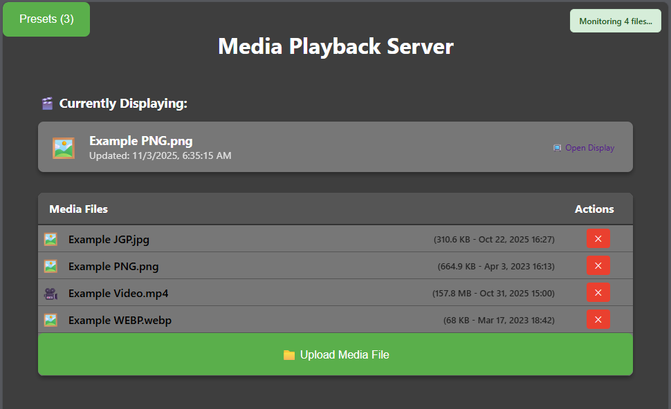
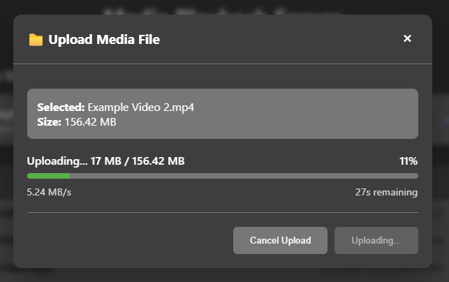

# PHP Media Playback Server
 
A lightweight, web-based media server designed for digital signage and display applications. Features real-time file monitoring, drag-and-drop uploads, preset configurations, and an intuitive web interface.
 

 
## Features
 
### 🎬 Media Management
- **Real-time File Monitoring** - Automatic detection of file changes with live updates
- **Drag & Drop Uploads** - Intuitive file upload with progress tracking
- **Multiple Format Support** - Video, audio, and image files
- **File Information Display** - Size, type, and modification details
 

 
### ⚙️ Configuration & Presets
- **Preset Management** - Create and manage media playlists/configurations
- **JSON Configuration** - Easy-to-edit configuration files
- **Real-time Updates** - Changes reflect immediately without server restart
 

 
### 🔧 Technical Features
- **Responsive Design** - Works on desktop, tablet, and mobile
- **AJAX-Powered Interface** - Smooth, no-reload interactions
- **Debug Mode** - Comprehensive logging for troubleshooting
- **Offline Detection** - Graceful handling of server connectivity issues
 
## Requirements
 
- **PHP 8.0+** (Recommended: PHP 8.4)
- **Web Server** (Apache recommended, Nginx supported) [PHP has a built in server but uploads will be slower.]
- **Modern Web Browser** (Chrome, Firefox, Safari, Edge)
 
## Installation
 
### Quick Start with Apache
1. **Clone the repository:**
```
   git clone https://github.com/Gryphon4200/PHP-Media-Playback-Server.git
   cd PHP-Media-Playback-Server
```

Configure your web server to point to the project directory

Set proper permissions:
```
    chmod 755 .
    chmod 666 config.json
    chmod 666 image.txt
    chmod 777 media/  # Your media directory
```
Access the web interface: http://localhost/

## Configuration
Edit config.json to customize your setup:
```
{
  "path": "/path/to/your/media/files/",
  "debug": false,
  "preset1": "default-video.mp4",
  "preset2": "fallback-image.jpg"
}
```

## Usage
### Basic Operation
Upload Files - Click "Upload Media File" or drag files onto the interface
Select Media - Click any file in the list to display it
Use Presets - Click the Presets dropdown to quickly switch between configured media

## Advanced Features
### File Monitoring
The system automatically monitors your media directory for changes:  
✅ New files are detected and added to the list  
✅ Deleted files are removed from the interface  
✅ Modified files trigger updates  
✅ Real-time status shows monitoring state  
  
### Upload Progress
Real-time speed tracking with current and average speeds
Time remaining estimation based on upload progress
Cancellation support with confirmation prompts
Large file optimization (tested up to 1GB)

### Preset Management
Dynamic configuration - Add/remove presets without server restart
Bulk updates - Modify multiple presets simultaneously
Validation - Ensures selected files exist before saving

## API Endpoints
### Endpoint	Method	Purpose
/update.php?file=filename	GET	Set active display file
/update.php?preset=key	GET	Activate preset configuration
/update.php	POST	Update configuration/delete files
/upload.php	POST	Upload new media files
/check_changes.php	GET	File monitoring API

## Development
### File Structure
```
PHP-Media-Playback-Server/
├── index.php              # Main interface
├── display.php            # Media display page
├── upload.php             # File upload handler
├── update.php             # Configuration & file management
├── check_changes.php      # File monitoring API
├── functions.php          # Core PHP functions
├── config.json           # Server configuration
├── image.txt             # Current display state
├── main.js               # Upload & UI functionality  
├── script.js             # File monitoring & presets
├── styles/               # CSS stylesheets
└── media/                # Media files directory
```  
### Debug Mode
Enable debug logging in config.json:
```
{
  "debug": true
}
```

This provides:
Console logging for all AJAX requests
Detailed error messages
Upload progress diagnostics
File monitoring status
Performance
Benchmarks
Local uploads: 50-100+ MB/s (Apache)
File monitoring: <1% CPU usage
Memory usage: <50MB for 1000+ files
Browser compatibility: All modern browsers

## Optimization Tips
Use Apache instead of PHP dev server for better upload performance
Enable gzip compression for faster page loads
Configure appropriate PHP limits:
```
upload_max_filesize = 1G
post_max_size = 1G
max_execution_time = 0
memory_limit = 1G
```

## Troubleshooting
### Common Issues
**Upload speeds are slow:**
Switch from PHP development server to Apache
Check PHP configuration limits
Ensure adequate server resources

**File monitoring not working:**
Verify check_changes.php exists and is accessible
Check file permissions on media directory
Enable debug mode for detailed logs
  
**Preset updates failing:**
Ensure config.json is writable
Check JSON syntax in configuration
Verify file paths are correct

## Getting Help
Enable debug mode in config.json
Check browser console for errors
Review server error logs
Create an issue with debug output

## Contributing
Fork the repository
Create a feature branch (git checkout -b feature/amazing-feature)
Commit your changes (git commit -m 'Add amazing feature')
Push to the branch (git push origin feature/amazing-feature)
Open a Pull Request

## License
This project is licensed under the MIT License - see the LICENSE file for details.

## Changelog
**v2.0.0 (Latest)**  
✅ Enhanced Upload System - Real-time progress, cancellation, drag & drop  
✅ File Monitoring - Automatic detection of file system changes  
✅ Improved Error Handling - Graceful offline detection and recovery  
✅ Responsive Design - Mobile-friendly interface  
✅ Debug Mode - Comprehensive logging system  
  
**v1.0.0**  
✅ Basic Media Management - Upload, display, delete files  
✅ Preset System - Quick switching between media configurations  
✅ Web Interface - Clean, intuitive design  

## Acknowledgments
Built for digital signage and media display applications
Optimized for reliability and ease of use

**Community-driven feature development**
⭐ If you find this project helpful, please consider starring the repository!
